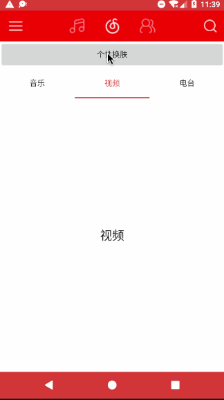

# SkinLoader

## 工程目录介绍

```
SkinLoader
├── app        // 皮肤库应用实例
├── appSkin    // 皮肤包生成demo
└── skinCore   // 皮肤加载库
```

## 演示



## 用法

1. 在`Application`中进行初始化

```java
public class MyApplication extends Application {

    @Override
    public void onCreate() {
        super.onCreate();
        SkinManager.init(this);
    }
}
```

2. 加载皮肤包

```java
SkinManager.getInstance().loadSkin(skin.path);
```

3. 重置皮肤包

```java
SkinManager.getInstance().loadSkin(null);
```

## 皮肤包如何生成

- 皮肤包（后缀名为`.skin`）的本质是一个apk文件，该apk文件不包含代码，只包含资源文件

- 在皮肤包工程中（示例工程为`appSkin`）添加需要换肤的同名的资源文件，直接编译生成apk文件，再更改后缀名为`.skin`即可（防止用户点击安装）